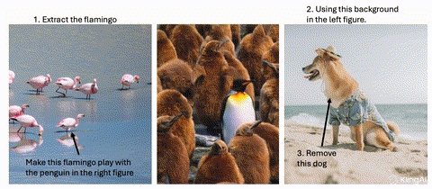

<div align="center">

# In-Video Instructions:<br>Visual Signals as Generative Control


<a href="https://fangggf.github.io/"><strong>Gongfan Fang</strong></a>
&nbsp;&nbsp;
<a href="https://horseee.github.io/"><strong>Xinyin Ma</strong></a>
&nbsp;&nbsp;
<a href="https://sites.google.com/site/sitexinchaowang/"><strong>Xinchao Wang</strong></a>

<strong>National University of Singapore</strong>

<span style="font-size: 1.1em;"><em>Preprint 2025</em></span>

[](https://arxiv.org/abs/ARXIV_PAPER_ID)
[](https://fangggf.github.io/In-Video)


<br>


<p><strong>“Visuals as Precise Control”</strong><br>
<em>The textual prompt is fixed as "Follow the instructions step by step," while the model synthesizes content purely from the embedded visual signals within the input frames.</em>
</p>

</div>

---

## 📖 Abstract

Large-scale video generative models have recently demonstrated strong visual capabilities. In this work, we investigate whether such capabilities can be harnessed for controllable image-to-video generation by interpreting visual signals embedded within the frames as instructions, a paradigm we term **In-Video Instruction**.

In contrast to prompt-based control, which provides textual descriptions that are inherently global and coarse, **In-Video Instruction encodes user guidance directly into the visual domain through elements such as overlaid text, arrows, or trajectories**. This enables explicit, spatial-aware, and unambiguous correspondences between visual subjects and their intended actions by assigning distinct instructions to different objects.

<div align="center">
  
  <p><em>Figure 1. Overview of the proposed In-Video Instruction framework.</em></p>
</div>

---

## 🎥 Generative Results

<table align="center">
  <tr>
    <td align="center">
      
      <br><strong>Example 02</strong>
    </td>
    <td align="center">
      
      <br><strong>Example 03</strong>
    </td>
  </tr>
  <tr>
    <td align="center">
      
      <br><strong>Example 04</strong>
    </td>
    <td align="center">
      
      <br><strong>Example 05</strong>
    </td>
  </tr>
  <tr>
    <td align="center">
      
      <br><strong>Example 06</strong>
    </td>
    <td align="center">
      
      <br><strong>Example 07</strong>
    </td>
  </tr>
  <tr>
    <td align="center">
      
      <br><strong>Example 08</strong>
    </td>
    <td align="center">
      
      <br><strong>Example 09</strong>
    </td>
  </tr>
   <tr>
    <td align="center">
      
      <br><strong>Example 10</strong>
    </td>
    <td align="center">
      
      <br><strong>Example 11</strong>
    </td>
  </tr>
</table>

---

## 📝 BibTeX

```bibtex
@article{fang2025invideo,
  title={In-Video Instructions: Visual Signals as Generative Control},
  author={Fang, Gongfan and Ma, Xinyin and Wang, Xinchao},
  journal={arXiv preprint arXiv:},
  year={2025}
}
